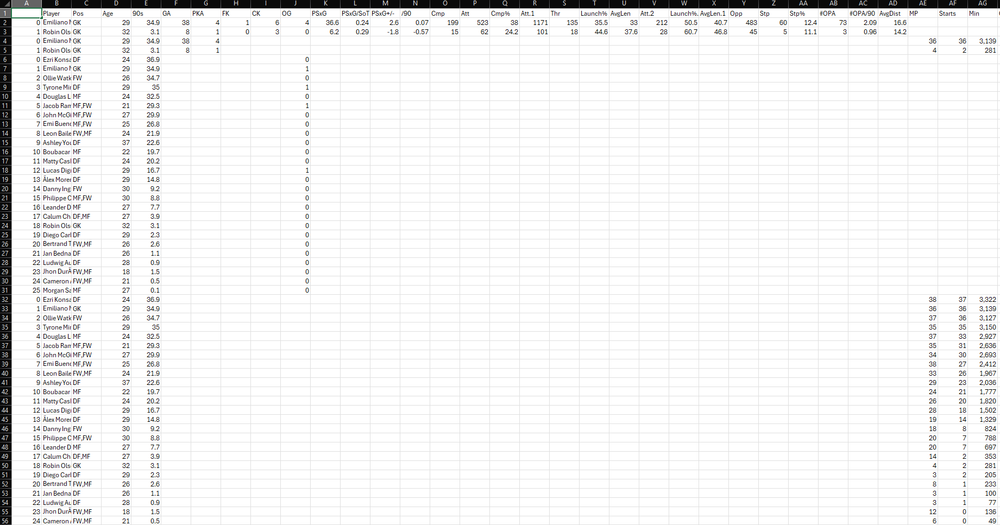

# Program for Pulling Premier League Stats

Currently, the data that is pulled from a team looks like so: 

### Next Tasks

1. Join DataFrames which combine all data by one player into one row 
2. Removing columns which are repetitive and don't add to the market value
3. Remove players that have not played more than a certain amont of games/ have no data